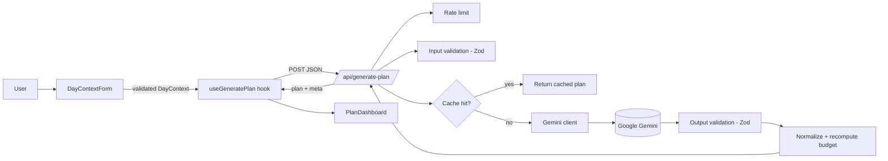
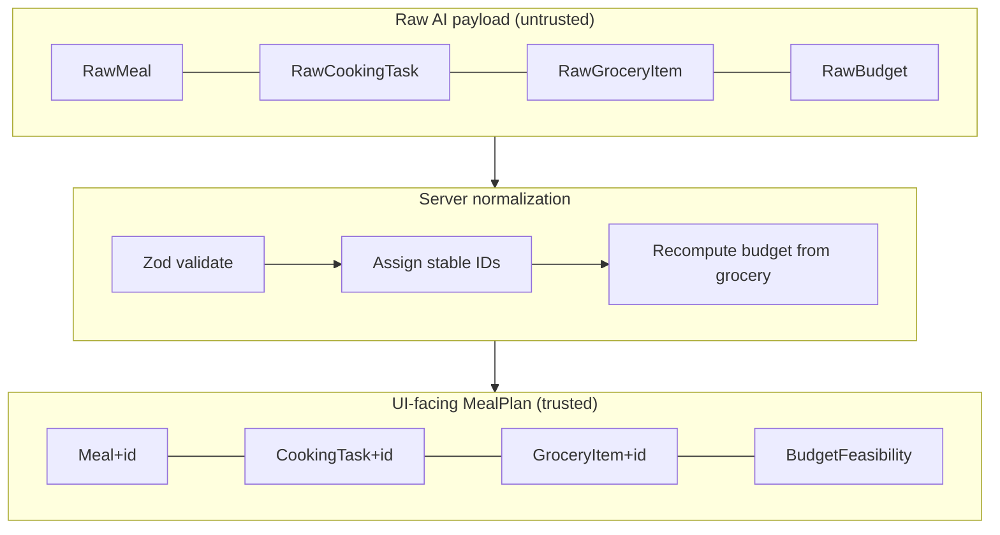
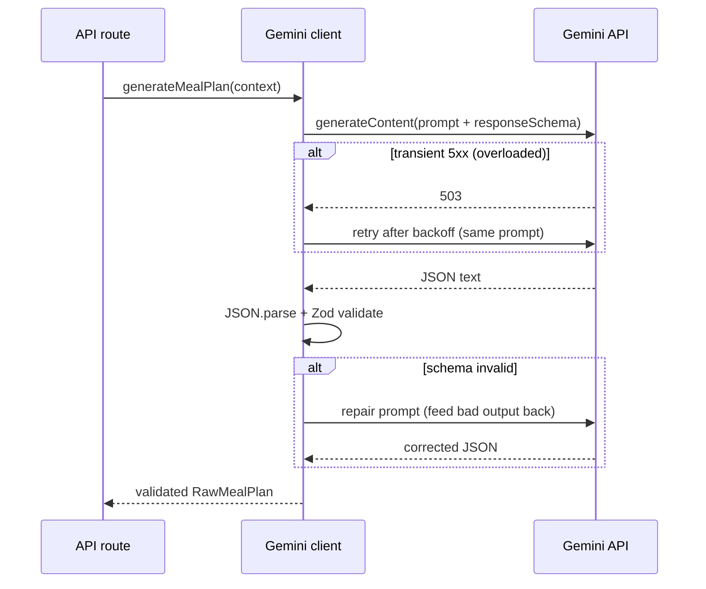
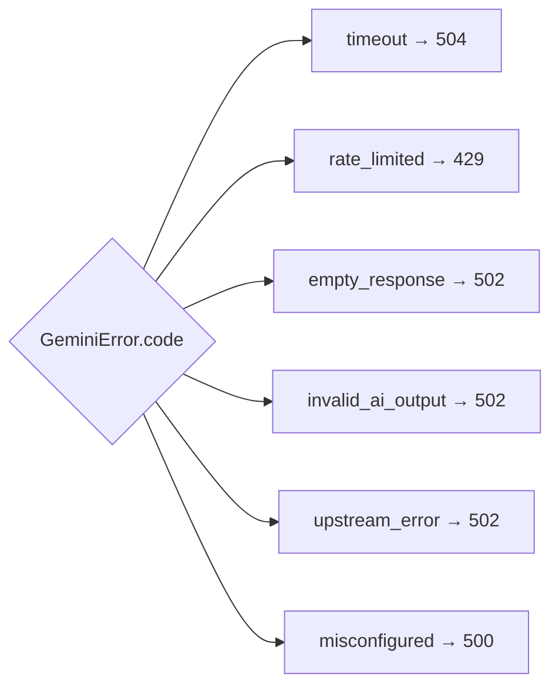
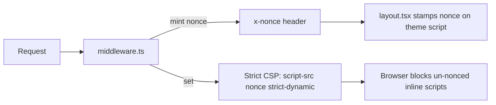
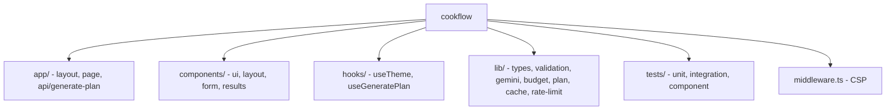
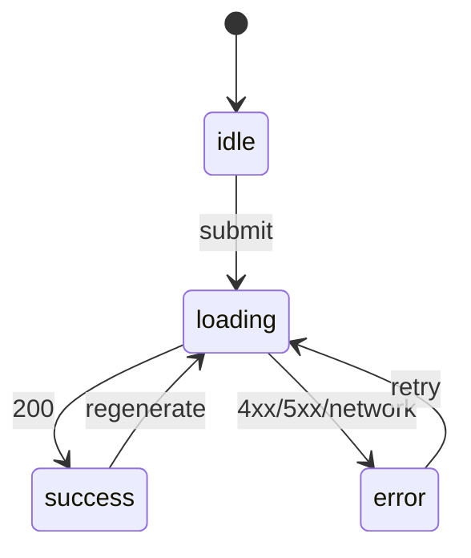

# 🍳 CookFlow — AI Cooking To-Do List

> Tell CookFlow about your day and your budget. It returns a **timed cooking to-do list**, a **consolidated grocery list**, **smart substitutions**, and an **honest budget check** — generated by Google Gemini and validated end-to-end.

CookFlow turns the vague daily question *"what do I cook, when, and can I afford it?"* into a concrete, time-ordered plan you can actually follow.

---

## ✨ Features

- **Timed cooking to-do list** — tasks scheduled chronologically between your wake and dinner times, with an interactive "cook mode" checklist and live progress.
- **Consolidated grocery list** — ingredients de-duplicated across meals, grouped by aisle, with one-click copy to clipboard.
- **Smart substitutions** — cheaper / dietary-friendly swaps, each with a concrete reason and estimated savings.
- **Trustworthy budget check** — the total is **recomputed on the server** from the grocery list; the AI's arithmetic is never trusted.
- **Pantry-aware** — plans around what you already have to cut cost.
- **Dietary & allergy aware** — respects tags and a free-text "avoid" list.
- **Polished UX** — light/dark themes (no flash), skeleton loaders, empty/error states, toasts, and full keyboard accessibility.

---

## 🧱 Tech Stack

| Layer | Choice |
| --- | --- |
| Framework | Next.js 15 (App Router) + React 19 |
| Language | TypeScript (strict, `noUncheckedIndexedAccess`) |
| Styling | Tailwind CSS with semantic CSS-variable tokens |
| AI | Google Gemini (`gemini-2.5-flash`) with native structured output |
| Validation | Zod (input **and** AI output) |
| Testing | Vitest + Testing Library (jsdom) |
| Deploy | Vercel-ready |

---

## 🏛️ Architecture

### High-level request flow



### The two-layer data model

Raw AI data is never trusted directly. It is validated, then normalized into a UI-safe shape with server-owned IDs and budget math.



### AI call with bounded retry



### Error taxonomy → HTTP status



### Security: nonce-based CSP



### Project structure



### Client state machine



---

## 🚀 Getting Started

### Prerequisites
- Node.js 20+ (see `.nvmrc`)
- A Google Gemini API key — free at [aistudio.google.com/apikey](https://aistudio.google.com/apikey)

### Install & run

```bash
npm install
cp .env.example .env.local   # then add your GEMINI_API_KEY
npm run dev                  # http://localhost:3000
```

### Environment variables

| Variable | Required | Default | Purpose |
| --- | --- | --- | --- |
| `GEMINI_API_KEY` | ✅ | — | Server-side Gemini key. **Never** prefix with `NEXT_PUBLIC_`. |
| `GEMINI_MODEL` | ❌ | `gemini-2.5-flash` | Override the model. |
| `RATE_LIMIT_MAX` | ❌ | `10` | Requests per IP per window. |
| `RATE_LIMIT_WINDOW_MS` | ❌ | `60000` | Rate-limit window (ms). |

> ⚠️ Not all models have free-tier quota on every key. `gemini-2.5-flash` is the verified default; `gemini-2.0-flash` may return `429 limit: 0` on free tier.

### Scripts

```bash
npm run dev        # dev server
npm run build      # production build
npm start          # serve production build
npm run lint       # eslint
npm run typecheck  # tsc --noEmit
npm test           # run the full test suite
```

---

## 🤖 AI Usage (Gemini)

- **Real calls** via `@google/generative-ai` from a **server-only** API route — the key never reaches the browser.
- **Native structured output**: a `responseSchema` forces valid JSON shape, then **Zod re-validates** as a second guard.
- **Prompt-injection defense**: untrusted free text is sanitized and fenced inside a labelled `USER_DATA` block; the model is instructed to treat it strictly as data.
- **Self-repair**: on a schema failure the invalid output is fed back once for correction.
- **Bounded retry**: transient `503 overloaded` responses are retried with backoff.
- **Timeout**: enforced via `Promise.race` (avoids a cross-runtime `AbortSignal` incompatibility in the SDK's own timeout option).

## 🔐 Security

- Server-only API key; strict, **nonce-based CSP** via middleware (`strict-dynamic`, no `unsafe-inline` for scripts).
- Static headers: `X-Content-Type-Options`, `X-Frame-Options: DENY`, `Referrer-Policy`, `Permissions-Policy`.
- All input **and** AI output validated with Zod; XSS handled by React escaping (no `dangerouslySetInnerHTML` except the nonced theme script).
- In-memory per-IP rate limiting.

## ♿ Accessibility

- Semantic landmarks, skip-to-content link, WAI-ARIA Tabs (roving tabindex + arrow keys).
- Labelled inputs with `aria-describedby` hints/errors, visible focus rings, `role="alert"`/`role="status"` live regions.
- WCAG-AA contrast in light and dark, `prefers-reduced-motion` respected.

## ⚡ Performance

- Input-hash cache for identical requests, LRU + TTL.
- Skeleton loaders, request de-duplication (aborts superseded calls), `localStorage` plan/draft persistence.

## 🧪 Testing

Run `npm test`. Coverage includes input & output validation, sanitization/prompt-injection, budget math & normalization, rate limiting, caching, the API route (all error mappings, cache, rate limit), and the form component. A network-gated live Gemini test can be added locally.

## ☁️ Deployment (Vercel)

1. Push to GitHub and import the repo in Vercel.
2. Set `GEMINI_API_KEY` (and optional overrides) in Project → Settings → Environment Variables.
3. Deploy. The API route runs on the Node.js runtime with `maxDuration = 60`.

## 🗺️ Future Improvements

- Multi-day / weekly planning, shared Redis-backed rate limit & cache, response streaming, saved plan history, and printable/exportable grocery lists.

## 📄 License

MIT — see [LICENSE](./LICENSE).
